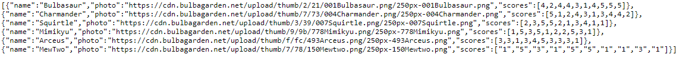

# Friend Finder

Have you, a pokemon, ever wondered which other pokemon you are truly compatible with?
Friend Finder is a Pokemon compatibility application. This application takes in results from you and other users, and then compares the results with the answers from other users (and pre-made users).

Technologies Used:
Node.js, Express.js, body-parser, path, heroku, Bootstrap, Chosen, JQuery

Front End: 
The Home and Survey pages were created using HTML and Bootstrap. In the Survey page, there is some Javascript/JQuery that stores the results from the users. An AJAX POST request is then made to send data (as objects) to the server. 

Back End: 
The back end is composed of a node/express server that stores results from the users as objects within a friends array. This is also where logic was implemented to compare data between users, and where the html routing was created. 

Live site: 

## How the Website Works Works 

In the homepage, you are prompted to go to the survey with a button. Once the button is clicked, you will be taken to the survey page.

Once you are in the survey page, you will have to input your name and a picture. Afterwards, you have to fill out 10 statements with answers ranging from a scale of 1 - 5. 1 means you strongly disagree with a statement, and 5 means you strongly agree with a statement.

If you do not fill out all of the fields, a validation process will alert you to ensure that all fields are filled out. 

After you have submited your answers, a modal will pop up displaying your best match. 
If you would like to see your results posted to the friends api, you can click on the link on the bottom of the page.

- - -

Copyright (c) 2017 Cassandra Villaruel